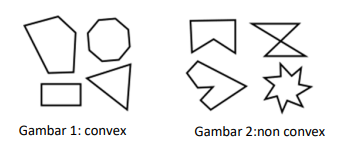

# LINIER_SEPARABILITY_TEST
Test kelinieran Convex Hull untuk Dataset tertentu

## Deskripsi Singkat
Pada Tucil kali ini akan dibuat sebuah pustaka (library) myConvexHull dalam bahasa Python yang dapat mengembalikan convex hull dari kumpulan data 2 dimensi (dapat dianggap kumpulan titik 2 dimensi). Himpunan titik pada bidang planar disebut convex jika untuk sembarang dua titik pada bidang tersebut (misal p dan q), seluruh segmen garis yang berakhir di p dan q berada pada himpunan tersebut. Contoh gambar 1 adalah poligon yang convex, sedangkan gambar 2 menunjukkan contoh yang non-convex.



## Requirement Program
- python untuk compile
- mathplotlib
- skylearn
- pandas

## Instalasi
Clone repositori ini dengan menggunakan command pada terminal:  
```
git clone https://github.com/Amike31/LINIER_SEPARABILITY_TEST
```

## Menjalankan Program
### Menggunakan Source Code
- Masuk ke dalam folder hasil clone
- Jalankan program menggunakan command berikut:  
```
cd src ; py Main.py
```
- Setelah program berjalan, akan disediakan 6 buah dataset pengujian yang berbeda. Anda dapat memilih dataset mana yang ingin dianalisis dan ditampilkan.
- Setelah melakukan pemilihan, akan ditampilkan beberapa instace dari dataset tersebut dan muncul pop up window Gambar analisis data tersebut.

## Output Program
### Pengjuian author
Anda dapat melihat hasil output program untuk masing-masing dataset di dalam folder output.
Namun, apabila anda ingin menyimpan hasil analisis baru, jalankan program, lalu setelah pop up window muncul anda dapat menyimpannya dengan menekan tombol "save"

## Author
Rahmat Rafid Akbar - 13520090
K03
